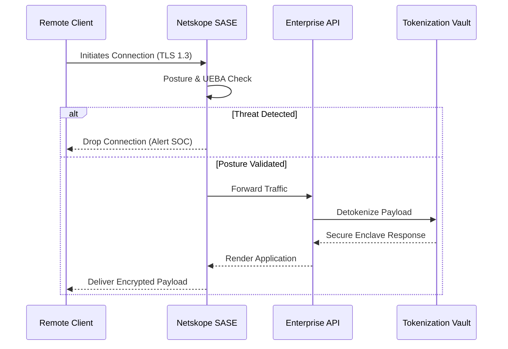

# ⚡ goz // rgosewehr // dr_goz

[\~]$ whoami  
Robert Gosewehr CISSP GWAPT   
[\~]$ groups  
Security_Engineer, Architect, Researcher, Open_Source_Advocate

---

> **Full-Stack Security Practitioner:** 20+ years navigating the bleeding edge of Tech & Security across many domains. I design enterprise security solutions by day and hunt high-impact threats by night. Working to make Security accessible to all through Consulting, Research, and Education. Operating on the principle of "Just Do It."
 

  

## 🛠️ The Full-Stack Security Arsenal:  🧰 Defensive Architecture & Offensive Exploitation

| Operational Domain | Core Technologies & Tooling |
|---|---|
| Enterprise & Cloud Architecture | AWS (EC2/S3/IAM/Security Hub), Azure, Netskope SASE, DevSecOps, Terraform (IaC) |
| Offensive Security | Burp Suite, Caido, OWASP, Metasploit, Nessus, Kali Linux, AI Powered Automation |
| Frontier Tech: AI & LLM Security | RAG, MCP Server Integrations, Prompt Injection, Secure AI Architecture |
| Data Governance & Cryptography | Protegrity, CyberArk, DSPM, CSPM, Oracle, Splunk, Rapid7, PCI-DSS, HIPAA |

 

<b>1. The Dark Side: Offensive Operations & Web Auditing</b>

 
I leverage an attacker's mindset to expose vulnerabilities in complex systems before they are weaponized.
  

<b>2. Frontier Threat Research: AI Security (2023-2026)</b>

 
Actively researching and developing mitigations for emerging AI threat vectors, including Prompt Manipulation, Indirect Injections in RAG architectures, and the security implications of AI Agents and MCP Servers.

<b>3. Enterprise Defense & Infrastructure</b>

 

 

## 📜 Verified Credentials

   

## 🌐 Open Source Citizenship

I believe in solving problems at their source. I am an active contributor to the **Fedora Project**, focusing on kernel release testing, security tooling, and security advisories. Giving back to the Open Source & Security communities is something that becomes increasingly more important to me as I advance further in my career.
  

## 📡 Conceptual Zero-Trust Implementation
*A high-level sequence diagram demonstrating a conceptual approach to Zero-Trust edge protection and data tokenization.*

 

## 🔐 Areas of Active Research & Development
*Current areas of interest and active research*

  <ul>
    <li>WebApp Security & Testing: GraphQL & REST APIs, Mobile Apps, & SAST/DAST</li>
    <li>Securing AI Architecture & Deploying AI-enabled Security Solutions</li>
    <li>Data Governance, Secure Cloud Operations, SASE/SSE, & DLP</li>
  </ul>
  

 

> *"In a landscape defined by adversarial AI and supply chain volatility, the only true perimeter is the resilience of the architecture itself."*

---

  <a href="https://linkedin.com/in/robertgosewehr">LinkedIn</a> | <a href="mailto:RobertGosewehr@gmail.com">Email</a>

